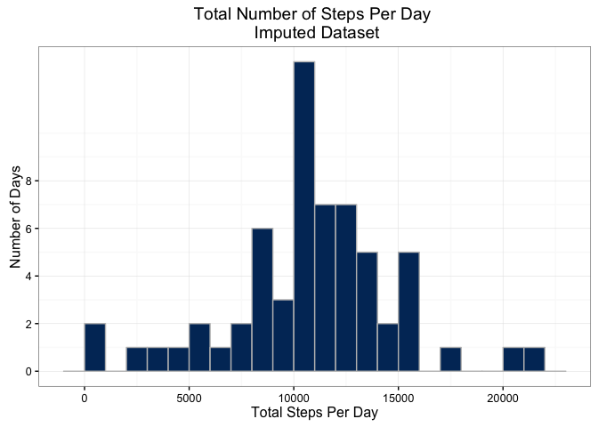

# Reproducible Research: Peer Assessment 1

This document outlines the steps to analyze anonymized data collected at 5-minute 
intervals from a personal activity monitoring device for October and 
November, 2012, including the number of steps taken.

## Loading and preprocessing the data

### Load Required Packages

First, will load required packages for this document and analysis. 


```r
        ## Load Required Packages
        require(dplyr)
```

```
## Loading required package: dplyr
```

```
## 
## Attaching package: 'dplyr'
```

```
## The following objects are masked from 'package:stats':
## 
##     filter, lag
```

```
## The following objects are masked from 'package:base':
## 
##     intersect, setdiff, setequal, union
```

```r
        require(ggplot2)
```

```
## Loading required package: ggplot2
```

```r
        require(knitr)
```

```
## Loading required package: knitr
```

```r
        require(mice)
```

```
## Loading required package: mice
```

```
## Loading required package: Rcpp
```

```
## mice 2.25 2015-11-09
```


The next step is to load and read the data from the forked repository from [Github](https://github.com/kpivert/RepData_PeerAssessment1). 


```r
        ## Unzip activity.zip  
        activityData <- unzip("/Users/kpivert/RepData_PeerAssessment1/activity.zip")
        
        ## Read Data 
        stepData <- read.csv(activityData, na.strings = "NA")
```


Finally, will examine the structure of the `stepData` dataframe.


```r
        str(stepData)
```

```
## 'data.frame':	17568 obs. of  3 variables:
##  $ steps   : int  NA NA NA NA NA NA NA NA NA NA ...
##  $ date    : Factor w/ 61 levels "2012-10-01","2012-10-02",..: 1 1 1 1 1 1 1 1 1 1 ...
##  $ interval: int  0 5 10 15 20 25 30 35 40 45 ...
```

```r
        summary(stepData)
```

```
##      steps                date          interval     
##  Min.   :  0.00   2012-10-01:  288   Min.   :   0.0  
##  1st Qu.:  0.00   2012-10-02:  288   1st Qu.: 588.8  
##  Median :  0.00   2012-10-03:  288   Median :1177.5  
##  Mean   : 37.38   2012-10-04:  288   Mean   :1177.5  
##  3rd Qu.: 12.00   2012-10-05:  288   3rd Qu.:1766.2  
##  Max.   :806.00   2012-10-06:  288   Max.   :2355.0  
##  NA's   :2304     (Other)   :15840
```

## What is mean total number of steps taken per day?

1. Make a histogram of the total number of steps taken each day. Per instructions, 
"NA" values will be omitted from analysis. 

* Will calculate total number of steps by day and produce a histogram of total 
steps by day. 


```r
        ## Calculate Total Steps By Date
        
        totalSteps <- aggregate(steps ~ date, data = stepData, sum, na.action = na.omit)
        
        ## Create Histogram Using ggplot2

        totalStepsHist <- ggplot(totalSteps, aes(steps))
        
        totalStepsHist + geom_histogram(binwidth = 500, color="grey", fill ="#003366") + 
          theme_bw()+
          ylab("Number of Days")+
          xlab("Total Steps Per Day")+
          scale_y_continuous(breaks = seq(0,8,2), 
                             labels = as.character(seq(0,8,2)))+
          ggtitle("Total Number of Steps Per Day \n Raw Dataset with NAs Removed")
```

\

2. Calculate and report the mean and median total number of steps taken per day

* Will calculate overall mean and median steps per day across 2-month data period. 


```r
      ## Mean Steps Per Day for 2-Month Period
      
      mean(stepData$steps, na.rm = TRUE)
```

```
## [1] 37.3826
```

```r
      ## Median Steps Per Day for 2-Month Period
      
      median(stepData$steps, na.rm = TRUE)
```

```
## [1] 0
```


* Will also determine the mean and median total number of steps per day. Per 
instructions, will ignore missing values for this calculation. Report each set of 
values in separate tables below.


```r
        ## Calculate Mean and Median Steps per day

        ## Mean Steps Per Day

        averageSteps <- aggregate(steps ~ date, data = stepData, mean, na.rm = TRUE)
        averageSteps$date <- strftime(averageSteps$date, format = "%B %d, %Y")
        
        ## Print Table With Mean Number of Steps Per Day
        kable(averageSteps, digits = 2, col.names = c("Date", "Mean No. of Steps"), 
              align = "c", 
              caption = "Mean Number of Steps per Day \n Raw Dataset with NAs Removed")
```


Table: Mean Number of Steps per Day 
 Raw Dataset with NAs Removed

       Date           Mean No. of Steps 
-------------------  -------------------
 October 02, 2012           0.44        
 October 03, 2012           39.42       
 October 04, 2012           42.07       
 October 05, 2012           46.16       
 October 06, 2012           53.54       
 October 07, 2012           38.25       
 October 09, 2012           44.48       
 October 10, 2012           34.38       
 October 11, 2012           35.78       
 October 12, 2012           60.35       
 October 13, 2012           43.15       
 October 14, 2012           52.42       
 October 15, 2012           35.20       
 October 16, 2012           52.38       
 October 17, 2012           46.71       
 October 18, 2012           34.92       
 October 19, 2012           41.07       
 October 20, 2012           36.09       
 October 21, 2012           30.63       
 October 22, 2012           46.74       
 October 23, 2012           30.97       
 October 24, 2012           29.01       
 October 25, 2012           8.65        
 October 26, 2012           23.53       
 October 27, 2012           35.14       
 October 28, 2012           39.78       
 October 29, 2012           17.42       
 October 30, 2012           34.09       
 October 31, 2012           53.52       
 November 02, 2012          36.81       
 November 03, 2012          36.70       
 November 05, 2012          36.25       
 November 06, 2012          28.94       
 November 07, 2012          44.73       
 November 08, 2012          11.18       
 November 11, 2012          43.78       
 November 12, 2012          37.38       
 November 13, 2012          25.47       
 November 15, 2012          0.14        
 November 16, 2012          18.89       
 November 17, 2012          49.79       
 November 18, 2012          52.47       
 November 19, 2012          30.70       
 November 20, 2012          15.53       
 November 21, 2012          44.40       
 November 22, 2012          70.93       
 November 23, 2012          73.59       
 November 24, 2012          50.27       
 November 25, 2012          41.09       
 November 26, 2012          38.76       
 November 27, 2012          47.38       
 November 28, 2012          35.36       
 November 29, 2012          24.47       

```r
        ## Median Steps Per Day
        medianSteps <- aggregate(steps ~ date, data = stepData, median, na.rm = TRUE)
        medianSteps$date <- strftime(medianSteps$date, format = "%B %d, %Y")
        
        ## Print Table With Median Number of Steps Per Day
        kable(medianSteps, digits = 2, col.names = c("Date", "Median No. of Steps"), 
              align = "c", caption = "Median Number of Steps per Day \n Raw Dataset with NAs Removed")
```


Table: Median Number of Steps per Day 
 Raw Dataset with NAs Removed

       Date           Median No. of Steps 
-------------------  ---------------------
 October 02, 2012              0          
 October 03, 2012              0          
 October 04, 2012              0          
 October 05, 2012              0          
 October 06, 2012              0          
 October 07, 2012              0          
 October 09, 2012              0          
 October 10, 2012              0          
 October 11, 2012              0          
 October 12, 2012              0          
 October 13, 2012              0          
 October 14, 2012              0          
 October 15, 2012              0          
 October 16, 2012              0          
 October 17, 2012              0          
 October 18, 2012              0          
 October 19, 2012              0          
 October 20, 2012              0          
 October 21, 2012              0          
 October 22, 2012              0          
 October 23, 2012              0          
 October 24, 2012              0          
 October 25, 2012              0          
 October 26, 2012              0          
 October 27, 2012              0          
 October 28, 2012              0          
 October 29, 2012              0          
 October 30, 2012              0          
 October 31, 2012              0          
 November 02, 2012             0          
 November 03, 2012             0          
 November 05, 2012             0          
 November 06, 2012             0          
 November 07, 2012             0          
 November 08, 2012             0          
 November 11, 2012             0          
 November 12, 2012             0          
 November 13, 2012             0          
 November 15, 2012             0          
 November 16, 2012             0          
 November 17, 2012             0          
 November 18, 2012             0          
 November 19, 2012             0          
 November 20, 2012             0          
 November 21, 2012             0          
 November 22, 2012             0          
 November 23, 2012             0          
 November 24, 2012             0          
 November 25, 2012             0          
 November 26, 2012             0          
 November 27, 2012             0          
 November 28, 2012             0          
 November 29, 2012             0          


## What is the average daily activity pattern?

1. Make a time series plot (i.e. type = "l") of the 5-minute interval (x-axis) and the average number of steps taken, averaged across all days (y-axis)

* Determine average number of steps by time interval
* Create a time series plot


```r
        ## Mean steps per interval
        averageInt <- aggregate(steps ~ interval, data = stepData, mean, na.rm = TRUE)

        ## Create time series plot

        averageIntPlot <- ggplot(averageInt, aes(x=interval, y=steps))
        
        averageIntPlot + geom_line(color="#003366", size = 1.5)+
          theme_bw()+
          ylab("Mean Steps per 5-Minute Interval")+
          xlab("Hours in 5-Minute Intervals")+
          ggtitle("Mean Steps Per 5-Minute Interval")+ 
          scale_x_continuous(breaks=seq(0,2000,500), labels = c("00:00", "05:00",
                "10:00", "15:00", "20:00"))
```

\


2. Which 5-minute interval, on average across all the days in the dataset, contains the maximum number of steps?

* Determine max 5-minute interval


```r
        ## What is the 5-minute interval that has the largest mean number of steps
        ## across the 2-month period? 

        averageInt[which.max(averageInt$steps),1] ## Interval 835 or 8:35 a.m. 
```

```
## [1] 835
```

## Imputing missing values

1. Calculate and report the number of `NA` values.


```r
        ## Determine number of NA values in dataframe
        ## apply(stepData, function(x) sum(is.na(x))) Original Code Didn't Work With             Knitr

        apply(is.na(stepData),2,sum)
```

```
##    steps     date interval 
##     2304        0        0
```

2. Devise a strategy for filling in all of the missing values in the dataset. 
Create a new dataset that is equal to the original dataset but with the missing data filled in.
* Will use `MICE` package with default settings to complete missing values


```r
        imputedStepData <- complete(mice(stepData, seed = 123))
```

```
## 
##  iter imp variable
##   1   1  steps
##   1   2  steps
##   1   3  steps
##   1   4  steps
##   1   5  steps
##   2   1  steps
##   2   2  steps
##   2   3  steps
##   2   4  steps
##   2   5  steps
##   3   1  steps
##   3   2  steps
##   3   3  steps
##   3   4  steps
##   3   5  steps
##   4   1  steps
##   4   2  steps
##   4   3  steps
##   4   4  steps
##   4   5  steps
##   5   1  steps
##   5   2  steps
##   5   3  steps
##   5   4  steps
##   5   5  steps
```

```r
        ## Verify no NAs remain
        sapply(imputedStepData, function(x) sum(is.na(x)))
```

```
##    steps     date interval 
##        0        0        0
```


3. Make a histogram of the total number of steps taken each day.


```r
        ## Calculate Total Steps By Date in Imputed Dataset
        
        totalImputedSteps <- aggregate(steps ~ date, data = imputedStepData, sum) 

        ## Create Histogram Using ggplot2

        totalImputedStepsHist <- ggplot(totalImputedSteps, aes(steps))
        
        totalImputedStepsHist + geom_histogram(binwidth = 500, color="grey", fill ="#003366") + 
          theme_bw()+
          ylab("Number of Days")+
          xlab("Total Steps Per Day")+
          scale_y_continuous(breaks = seq(0,8,2), 
                             labels = as.character(seq(0,8,2)))+
          ggtitle("Total Number of Steps Per Day \n Imputed Dataset")
```

\


4. Calculate and report the mean and median total number of steps taken per day. 
* First calculate mean and median steps per day


```r
        ## Calculate Mean and Median Steps per day: Imputed Dataset

        ## Mean Steps Per Day

        averageImpSteps <- aggregate(steps ~ date, data = imputedStepData, mean)
        averageImpSteps$date <- strftime(averageImpSteps$date, format = "%B %d, %Y")
        
        ## Print Table With Mean Number of Steps Per Day: Imputed Dataset
        kable(averageImpSteps, digits = 2, col.names = c("Date", "Mean No. of Steps"),
              align = "c", 
              caption = "Mean Number of Steps per Day \n Imputed Dataset")
```


Table: Mean Number of Steps per Day 
 Imputed Dataset

       Date           Mean No. of Steps 
-------------------  -------------------
 October 01, 2012           46.21       
 October 02, 2012           0.44        
 October 03, 2012           39.42       
 October 04, 2012           42.07       
 October 05, 2012           46.16       
 October 06, 2012           53.54       
 October 07, 2012           38.25       
 October 08, 2012           29.86       
 October 09, 2012           44.48       
 October 10, 2012           34.38       
 October 11, 2012           35.78       
 October 12, 2012           60.35       
 October 13, 2012           43.15       
 October 14, 2012           52.42       
 October 15, 2012           35.20       
 October 16, 2012           52.38       
 October 17, 2012           46.71       
 October 18, 2012           34.92       
 October 19, 2012           41.07       
 October 20, 2012           36.09       
 October 21, 2012           30.63       
 October 22, 2012           46.74       
 October 23, 2012           30.97       
 October 24, 2012           29.01       
 October 25, 2012           8.65        
 October 26, 2012           23.53       
 October 27, 2012           35.14       
 October 28, 2012           39.78       
 October 29, 2012           17.42       
 October 30, 2012           34.09       
 October 31, 2012           53.52       
 November 01, 2012          42.39       
 November 02, 2012          36.81       
 November 03, 2012          36.70       
 November 04, 2012          36.15       
 November 05, 2012          36.25       
 November 06, 2012          28.94       
 November 07, 2012          44.73       
 November 08, 2012          11.18       
 November 09, 2012          35.68       
 November 10, 2012          36.49       
 November 11, 2012          43.78       
 November 12, 2012          37.38       
 November 13, 2012          25.47       
 November 14, 2012          40.17       
 November 15, 2012          0.14        
 November 16, 2012          18.89       
 November 17, 2012          49.79       
 November 18, 2012          52.47       
 November 19, 2012          30.70       
 November 20, 2012          15.53       
 November 21, 2012          44.40       
 November 22, 2012          70.93       
 November 23, 2012          73.59       
 November 24, 2012          50.27       
 November 25, 2012          41.09       
 November 26, 2012          38.76       
 November 27, 2012          47.38       
 November 28, 2012          35.36       
 November 29, 2012          24.47       
 November 30, 2012          32.61       

```r
        ## Median Steps Per Day
        medianImpSteps <- aggregate(steps ~ date, data = imputedStepData, median)
        medianImpSteps$date <- strftime(medianImpSteps$date, format = "%B %d, %Y")
        
        ## Print Table With Median Number of Steps Per Day: Imputed Dataset
        kable(medianImpSteps, digits = 2, col.names = c("Date", "Median No. of Steps"), 
              align = "c", caption = "Median Number of Steps per Day \n Imputed Dataset")
```


Table: Median Number of Steps per Day 
 Imputed Dataset

       Date           Median No. of Steps 
-------------------  ---------------------
 October 01, 2012              0          
 October 02, 2012              0          
 October 03, 2012              0          
 October 04, 2012              0          
 October 05, 2012              0          
 October 06, 2012              0          
 October 07, 2012              0          
 October 08, 2012              0          
 October 09, 2012              0          
 October 10, 2012              0          
 October 11, 2012              0          
 October 12, 2012              0          
 October 13, 2012              0          
 October 14, 2012              0          
 October 15, 2012              0          
 October 16, 2012              0          
 October 17, 2012              0          
 October 18, 2012              0          
 October 19, 2012              0          
 October 20, 2012              0          
 October 21, 2012              0          
 October 22, 2012              0          
 October 23, 2012              0          
 October 24, 2012              0          
 October 25, 2012              0          
 October 26, 2012              0          
 October 27, 2012              0          
 October 28, 2012              0          
 October 29, 2012              0          
 October 30, 2012              0          
 October 31, 2012              0          
 November 01, 2012             0          
 November 02, 2012             0          
 November 03, 2012             0          
 November 04, 2012             0          
 November 05, 2012             0          
 November 06, 2012             0          
 November 07, 2012             0          
 November 08, 2012             0          
 November 09, 2012             0          
 November 10, 2012             0          
 November 11, 2012             0          
 November 12, 2012             0          
 November 13, 2012             0          
 November 14, 2012             0          
 November 15, 2012             0          
 November 16, 2012             0          
 November 17, 2012             0          
 November 18, 2012             0          
 November 19, 2012             0          
 November 20, 2012             0          
 November 21, 2012             0          
 November 22, 2012             0          
 November 23, 2012             0          
 November 24, 2012             0          
 November 25, 2012             0          
 November 26, 2012             0          
 November 27, 2012             0          
 November 28, 2012             0          
 November 29, 2012             0          
 November 30, 2012             0          

* Then calculate overall mean and median steps per day for imputed dataset across 2-month data period. 


```r
      ## Mean Steps Per Day for 2-Month Period: Imputed Dataset
      
      mean(imputedStepData$steps)
```

```
## [1] 37.39105
```

```r
      ## Median Steps Per Day for 2-Month Period: Imputed Dataset
      
      median(imputedStepData$steps)
```

```
## [1] 0
```

#### Do these values differ from the estimates from the first part of the assignment? 
* **Raw Datset Overall Mean:** 37.38 steps per day
* **Imputed Dataset Overall Mean:** 37.91 steps per day
*There is a minimal difference in mean steps per day between the raw and imputed dataset.*

* **Raw Datset Overall Median:** 0 steps per day
* **Imputed Dataset Overall Median:** 0 steps per day
*There is no difference in median steps per day between the raw and imputed dataset.*

#### What is the impact of imputing missing data on the estimates of the total daily number of steps?   

***Imputing missing data has no affect on estimatse of total daily number of steps.***  

## Are there differences in activity patterns between weekdays and weekends?

1. Create a new factor variable in the dataset with two levels -- "weekday" and "weekend" indicating whether a given date is a weekday or weekend day.


```r
        ## Create new factor in imputed dataset
        
        ## Convert date data to date

        imputedStepData$date <- as.Date(imputedStepData$date)
        
        ## Add Days of Week Column to Dataframe
        
        imputedStepData$days <- weekdays(imputedStepData$date)
        
        ## Add New Factor
        
        mtwrf <- c("Monday", "Tuesday", "Wednesday", "Thursday", "Friday")
        
        imputedStepData$wkDaywkEnd <- ifelse(imputedStepData$days %in% mtwrf, TRUE, FALSE) ## TRUE = Weekday, FALSE = Weekend
        
        imputedStepData$wkDaywkEnd <- factor(imputedStepData$wkDaywkEnd, labels = c("Weekend", "Weekday"))
```

2. Make a panel plot containing a time series plot (i.e. type = "l") of the 5-minute interval (x-axis) and the average number of steps taken, averaged across all weekday days or weekend days (y-axis). The plot should look something like the following, which was created using simulated data:


```r
        ## Mean steps per interval: Imputed Dataset
        averageIntImpute <- aggregate(steps ~ interval + wkDaywkEnd, data = imputedStepData, mean)

        ## Create time series plot

        averageIntImputePlot <- ggplot(averageIntImpute, aes(x=interval, y=steps))
        
        averageIntImputePlot + geom_line(color="#003366", size = 0.9)+
          facet_grid(wkDaywkEnd ~ .)+
          theme_bw()+
          ylab("Mean Steps per 5-Minute Interval")+
          xlab("Hours in 5-Minute Intervals")+
          ggtitle("Mean Steps Per 5-Minute Interval \n Imputed Data: Weekday vs. Weekend")+ 
          scale_x_continuous(breaks=seq(0,2000,500), labels = c("00:00", "05:00",
                "10:00", "15:00", "20:00"))
```

\

